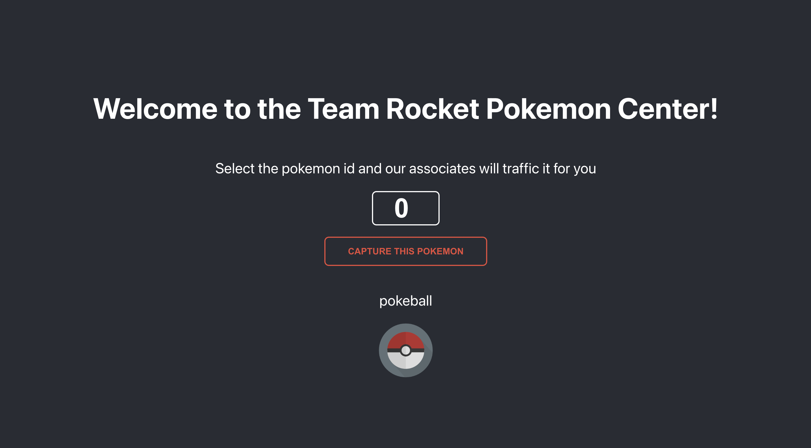

# Fullstack Developer - Test #

![logo_TypeScript] ![logo_Nodejs] ![logo_Expressjs] ![logo_React]

## Objetivo ##

- Exibir no frontend um input de texto que ao escrever um número de 1 a 900 e ao usuário pressionar um botão, renderizar na tela o nome do pokémon daquele número.
- Seguir a estratégia do Frontend não se comunicar diretamente com a API do Pokémon e sim ele se comunicar com o backend local.
- Ter uma requisição de **GET** exibindo uma lista de usuários no endpoint de **/pokemon/** na api <https://pokeapi.co/>.
- Exibir o nome do pokémon correspondente do número digitado no frontend.

## Informações técnicas ##

- Fazer as requisições necessárias na API <https://pokeapi.co/api/v2>.
- Atente-se a qualidade do código.
- Utilizar **TypeScript**.

![gif_pokemom]

[logo_Nodejs]: https://img.shields.io/badge/node.js-6DA55F?style=for-the-badge&logo=node.js&logoColor=white "NodeJS Logo"
[logo_TypeScript]: https://img.shields.io/badge/typescript-007ACC.svg?style=for-the-badge&logo=typescript&logoColor=white "Logo TypeScript"
[logo_Expressjs]: https://img.shields.io/badge/express.js-%23404d59.svg?style=for-the-badge&logo=express&logoColor=%2361DAFB "ExpressJS Logo"
[logo_React]: https://img.shields.io/badge/react-20232a?style=for-the-badge&logo=react&logoColor=61DAFB "React Logo"
[gif_pokemom]: https://pporg-cdn.nullcontent.net/monthly_2021_01/large.5f3b7da953ca75b6-animated-pokemon-gif-auto-design-tech.gif.8149f6785bbf6d5b0614fc68a987f815.gif
